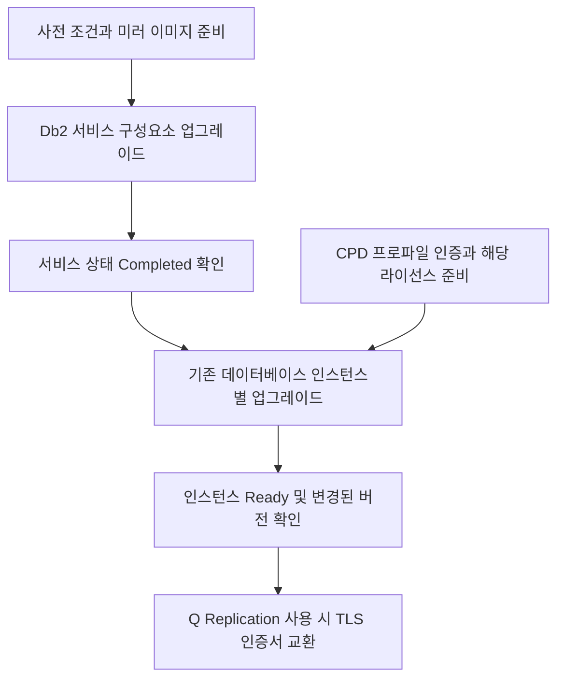

# Db2 업그레이드 흐름과 문서 안내

작성일: 2026-09-16  
대상: `현대/공식문서/531/서비스/db2` 폴더의 문서 6개  
목적: Software Hub 5.1 → 5.3 업그레이드에서 각 문서의 역할과 실행 순서를 이해한다.

## 목차

1. [확인 범위와 원문](#1-확인-범위와-원문)
2. [핵심 개념: 서비스와 데이터베이스 인스턴스](#2-핵심-개념-서비스와-데이터베이스-인스턴스)
3. [파일별 역할](#3-파일별-역할)
4. [전체 진행 순서](#4-전체-진행-순서)
5. [현재 GetToken 401 오류의 위치](#5-현재-gettoken-401-오류의-위치)
6. [명령의 역할과 성공 확인](#6-명령의-역할과-성공-확인)
7. [조건에 따라 적용하는 작업과 주의점](#7-조건에-따라-적용하는-작업과-주의점)
   - [DB2U_ID와 StatefulSet 확인](#db2u_id와-statefulset-확인)
8. [다음에 읽을 문서](#8-다음에-읽을-문서)

## 1. 확인 범위와 원문

아래 파일별 역할 표에 있는 로컬 문서 6개의 본문과 사용자가 제공한 IBM 프로파일 생성 페이지를 읽고 정리했다. 프로파일 페이지의 사용자 제공 본문은 **2026-09-11 갱신본**이다. 업그레이드·라이선스·TLS 페이지는 이번 온라인 조회에서 본문을 확보하지 못해 **기존 수집본 기반**으로 설명한다.

이 문서는 개념과 문서 간 관계를 설명하는 안내다. 작성 중 클러스터 접속, API 키 검증, Db2 업그레이드 또는 라이선스 변경을 수행하지 않았다.

| 원문 주제 | IBM 링크 | 이번 설명의 근거 |
| --- | --- | --- |
| Db2 5.1 → 5.3 업그레이드 | [Upgrading Db2](https://www.ibm.com/docs/en/software-hub/5.3.x?topic=u-upgrading-from-version-51-35) | 로컬 파일 1과 4의 수집 본문 |
| CPD 프로파일 생성 | [Creating a cpd-cli profile](https://www.ibm.com/docs/en/software-hub/5.3.x?topic=cli-creating-cpd-profile) | 로컬 파일 2와 사용자 제공 원문 |
| 배포 전 라이선스 설정 | [Upgrading the license before you deploy Db2](https://www.ibm.com/docs/en/software-hub/5.3.x?topic=setup-upgrading-license-before-you-deploy-db2) | 로컬 파일 3의 수집 본문 |
| Q Replication TLS 교환 | [Trusting targets and exchanging Db2 TLS certificates](https://www.ibm.com/docs/en/SSNFH6_5.3.x/qrep/t_db2-repl-trst_trgts_xchng_tls_certs.html) | 로컬 파일 5의 수집 본문 |
| 설치 후 설정 개요 | [Post-installation setup](https://www.ibm.com/docs/en/software-hub/5.3.x?topic=db2-post-installation-setup) | 로컬 `setup/1`의 수집 본문 |

`setup/1`은 여러 후속 문서를 소개하는 개요다. 그 문서에서 소개하는 하위 페이지 전체를 이번에 읽거나 검증한 것은 아니다.

## 2. 핵심 개념: 서비스와 데이터베이스 인스턴스

**Db2 업그레이드는 서비스 구성요소 업그레이드와 기존 데이터베이스 인스턴스 업그레이드로 나뉜다.**

| 구분 | 의미 | 문서에서 사용하는 확인 기준 |
| --- | --- | --- |
| Db2 서비스 구성요소 | Db2 배포를 관리하는 Operator와 서비스 설정을 담은 커스텀 리소스(CR) | 서비스 상태 `Completed` |
| Db2 서비스 인스턴스 | 데이터베이스를 보유하고 애플리케이션의 요청을 처리하는 실제 Db2 배포 | 해당 `Db2uCluster` 또는 `Db2uInstance`가 `Ready`, 인스턴스 상태 및 버전 확인 |

Operator는 OpenShift에서 Db2 배포를 관리하는 프로그램이다. 커스텀 리소스는 원하는 설정과 처리 상태를 OpenShift에 표현하는 객체다.

예를 들어 Db2 서비스 구성요소가 `Completed`여도 기존 데이터베이스 인스턴스의 업그레이드는 따로 남아 있을 수 있다. 전체 완료 여부는 각 인스턴스까지 확인해야 한다.

또한 제목의 **5.1 → 5.3은 Software Hub 릴리스 구분**이다. Db2 데이터베이스 엔진 버전은 별도로 확인하며, 이 문서에는 Db2 12.1 라이선스 준비도 등장한다.

## 3. 파일별 역할

| 파일 | 설명 | 언제 읽는가 |
| --- | --- | --- |
| [1-db2-업그레이드-51to53.md](1-db2-업그레이드-51to53.md) | 서비스 구성요소와 기존 인스턴스를 업그레이드하고 검증하는 주 절차 | 전체 순서를 파악할 때 |
| [2-프로파일-생성-cpd-cli.md](2-프로파일-생성-cpd-cli.md) | CPD URL, 사용자명, 사용자 API 키를 CLI 프로파일로 연결 | 인스턴스 조회·상태 확인·업그레이드 전에 |
| [3-db2-라이선스-업그레이드.md](3-db2-라이선스-업그레이드.md) | Standard/Advanced 라이선스 파일을 서비스 설정에 반영 | 기존 라이선스 에디션과 Db2 12.1 라이선스 준비를 확인할 때 |
| [4-upgrade](4-upgrade) | 파일 1과 같은 업그레이드 절차를 다른 형식으로 저장한 본문 | 파일 1의 설명을 대조할 때. 별도의 추가 업그레이드 단계가 아님 |
| [5-tls](5-tls) | Q Replication 원본·대상 시스템 간 신뢰 설정과 TLS 인증서 교환 | Q Replication을 사용하는 환경에서 업그레이드 후 |
| [setup/1](setup/1) | 인스턴스 생성, 권한, 라이선스, 네임스페이스 등 설치 후 설정의 개요 | 환경에 필요한 후속 설정을 찾을 때 |

파일 번호는 읽을 자료를 구분하는 번호다. 1부터 5까지 모든 명령을 한 번씩 실행하는 순서를 뜻하지 않는다.

## 4. 전체 진행 순서



### 4.1 사전 조건

파일 1의 개별 서비스 업그레이드 절차는 Software Hub 제어부가 먼저 업그레이드된 상태를 전제로 한다. 제어부와 서비스를 함께 업그레이드하는 경우에는 원문이 연결하는 플랫폼 통합 업그레이드 절차를 따른다.

폐쇄망 환경에서는 다음 준비가 필요하다.

- 목표 릴리스·패치에 필요한 Db2 이미지를 사설 레지스트리에 미러링한다.
- CLI가 필요한 `olm-utils-v4` 이미지를 사용할 수 있도록 준비한다.
- 클러스터 범위 리소스와 이미지 pull secret 등 원문의 사전 조건을 충족한다.
- 대상 네임스페이스, 릴리스, 패치, 레지스트리 값을 환경변수에 정확히 지정한다.

**Db2의 Software Hub 릴리스와 패치 수준은 제어부와 맞춘다.** 문서의 예시에 더 높은 패치 번호가 보인다는 이유로 현재 작업 목표를 자동으로 바꾸지 않는다.

### 4.2 서비스 구성요소 업그레이드

`cpd-cli manage install-components`에 `--components=db2oltp`와 `--upgrade=true`를 지정하는 부분이다. Operator와 Db2 서비스 CR을 갱신한다.

이 단계는 OpenShift에 대한 관리 권한을 사용한다. 명령의 성공 결과와 `get-cr-status`의 서비스 상태 `Completed`를 확인한다.

### 4.3 기존 데이터베이스 인스턴스 업그레이드

서비스 구성요소 업그레이드 이후에는 각 인스턴스를 다음 순서로 처리한다.

1. Db2 서비스 인스턴스 목록을 조회한다.
2. 목록에서 업그레이드할 인스턴스 이름을 선택한다.
3. 해당 인스턴스의 실행 상태를 확인한다.
4. 인스턴스 업그레이드를 실행한다.
5. 해당 Kubernetes 리소스가 `Ready`가 될 때까지 상태를 확인한다.
6. CPD 인스턴스 상태와 변경된 데이터베이스 버전을 확인한다.
7. 다른 인스턴스에도 필요한 작업을 반복한다.

CPD에서 보이는 인스턴스 이름과 OpenShift 리소스의 `<instance_id>`는 문서에서 용도를 구분한다. 한 값을 모든 명령에 그대로 넣지 않는다.

### 4.4 CPD 인스턴스 이름·ID와 OpenShift 리소스 이름의 차이

확인일: 2026-09-16. **CPD의 인스턴스 이름과 인스턴스 ID가 같은 값이라는 뜻이 아니다.** 세 값을 구분해야 한다.

| 구분 | 예시 | 사용하는 곳 |
| --- | --- | --- |
| CPD 서비스 인스턴스 이름 | `Db2-Instance` | `cpd-cli service-instance list`의 `Name` 열, 업그레이드 절차의 `INSTANCE_NAME`과 `--instance-name` |
| CPD 서비스 인스턴스 ID | `1689782702423826` | 같은 목록의 `ID` 열 |
| OpenShift의 Db2 CR 이름 | `db2oltp-1689782702423826` | `oc get db2ucluster` 또는 `oc get db2uinstance`의 `NAME` 열. 이 안내의 `DB2U_ID`에 사용하는 값 |

예시 값은 사용자 클러스터의 실측값이 아니다. [IBM 5.3.x의 서비스 인스턴스 출력 예시](https://www.ibm.com/docs/en/software-hub/5.3.x?topic=tddw-service-instance-in-unknown-state-post-backup-restore)에서 `ID`와 `Name`이 별도 열로 출력되는 부분을 확인했다. 해당 페이지의 장애 복구·ConfigMap 수정 절차를 현재 환경에 적용하라는 의미는 아니다.

[IBM 5.3.x의 Db2 설정 문서](https://www.ibm.com/docs/en/software-hub/5.3.x?topic=configuration-changing-db2-settings)는 CR 목록을 조회하고 **CR 이름**을 지정하도록 안내한다. `oc get <종류> <이름>`은 그 네임스페이스에서 해당 이름의 Kubernetes 객체를 조회한다.

따라서 파일 1에 있는 다음 두 명령에서 `<instance_id>` 자리에 들어가는 값은 **실제 CR 이름**이다.

- `oc get db2ucluster <instance_id>`: 대상 `Db2uCluster`의 `metadata.name`
- `oc get db2uinstance <instance_id>`: 대상 `Db2uInstance`의 `metadata.name`

이 문맥에서 `<instance_id>`와 `DB2U_ID`를 같은 값으로 설명한 것은 전체 CR 이름을 뜻한 것이다. CPD의 `INSTANCE_NAME`, CPD 목록의 숫자 `ID`까지 같은 값이라는 뜻은 아니다. 숫자 ID에 접두어를 임의로 붙여 추측하기보다 실제 `oc get` 목록의 `NAME`으로 확인한다.

## 5. 현재 GetToken 401 오류의 위치

사용자가 제공한 출력에서 다음 로컬 연결은 확인됐다.

```text
cpd-profile
  ├─ CPD URL: 실제 저장값은 아직 확인하지 못함
  └─ cpadmin-local
       ├─ CPD 사용자명: cpadmin
       └─ CPD 사용자 API 키: 유효성은 아직 확인하지 못함
```

`cpadmin-local`은 CLI 설정 안에서 사용하는 이름이다. 실제 CPD 로그인 사용자명은 `cpadmin`이다. 설정은 배스천에서 명령을 실행하는 Linux 계정의 `$HOME/.cpd-cli/config`에 저장된다.

`service-instance list`를 실행하면 CLI는 프로파일의 URL과 사용자 인증 정보를 이용해 CPD 인증 토큰을 얻는다. 현재의 `GetToken ... 401`은 **그 토큰 요청이 거부된 단계**다. 제공된 로그에서는 아직 인스턴스 목록을 받지 못했다.

확인된 사실과 미확인 사항을 구분한다.

- 확인됨: `cpd-profile → cpadmin-local → cpadmin` 연결이 존재한다.
- 미확인: 저장된 URL이 실제 대상 CPD 주소와 일치하는지.
- 미확인: 저장된 API 키가 해당 CPD 인스턴스의 `cpadmin`에게 발급된 유효한 키인지.
- 미확인: 사용자가 단독으로 입력한 `sha256~` 형식 값을 실제 CPD API 키 설정에도 사용했는지.

CPD 사용자 API 키는 CPD 웹 콘솔의 **Profile and settings**에서 얻는다. OpenShift 로그인 토큰이나 이미지 다운로드용 entitlement key를 CPD 사용자 API 키 자리에 넣었다면 올바른 키로 설정을 갱신해야 한다. 다만 현재 출력만으로 실제 저장된 키의 종류를 확정할 수는 없다.

**버전 확인도 별개로 필요하다.** 사용자가 실행한 CLI는 `14.4.0` / `SWH Release Version: 5.4.0`을 표시했다. 사용자가 제공한 5.3.x 프로파일 문서의 전제는 `14.3.1.13`이다. 이 두 값은 2026-09-16에 제공된 자료 기준이며, CLI 출력만으로 클러스터의 실제 CPD 설치 버전을 확정할 수 없다. 이 차이가 이번 `401`의 원인이라고도 단정하지 않는다.

## 6. 명령의 역할과 성공 확인

아래 표는 명령의 역할을 설명한다. 실제 업그레이드 명령 전체와 환경변수는 파일 1에서 확인한다.

| 명령 계열 | 목적 | 확인할 결과 |
| --- | --- | --- |
| `cpd-cli config users set` | 로컬 사용자 이름에 CPD 사용자명과 API 키를 저장 | 올바른 사용자 설정 후 인증 요청 성공 |
| `cpd-cli config profiles set` | 프로파일에 CPD URL과 로컬 사용자를 연결 | 올바른 대상에 연결하고 인증 요청 성공 |
| `cpd-cli manage install-components` | Db2 서비스 구성요소 업그레이드 | 명령 성공 결과 |
| `cpd-cli manage get-cr-status` | 서비스 CR 상태 조회 | `Completed` |
| `cpd-cli service-instance list` | 사용자에게 보이는 서비스 인스턴스 조회 | 인증 오류 없이 목록 조회 |
| `cpd-cli service-instance status` | 선택한 인스턴스 상태 조회 | 원문에서 요구하는 실행 상태 확인 |
| `cpd-cli service-instance upgrade` | 선택한 기존 인스턴스 업그레이드 | 이후 CR 상태·인스턴스 상태·버전 검증 |

현재 프로파일로 인증과 목록 조회를 확인하는 명령은 다음과 같다.

```bash
cpd-cli service-instance list \
  --service-type=db2oltp --profile=cpd-profile
```

- 실행 위치: 해당 프로파일을 구성한 배스천의 같은 Linux 계정. 현재 제공된 로그에서는 `root`다.
- 권한: 연결된 CPD 사용자에게 원문이 요구하는 서비스 인스턴스 권한이 있어야 한다. 원문은 `can_provision` 또는 `manage_service_instances`를 명시한다.
- 성공 확인: `GetToken` 오류 없이 명령이 완료된다. 목록이 비어 있으면 사용자가 볼 수 있는 인스턴스 유무와 권한을 따로 확인한다.

서비스 업그레이드는 `Completed`, 인스턴스 업그레이드는 `Ready`와 변경된 버전까지 확인한다. Q Replication의 인증서 교환은 별도의 API 응답에서 `TRUSTED`, `executionState=COMPLETED`, `overallJobResult=PASS`를 확인한다.

## 7. 조건에 따라 적용하는 작업과 주의점

### 라이선스

Db2 `.lic` 파일은 사용 중인 Db2 에디션을 위한 라이선스다. CPD API 키는 사용자 인증 정보다. 두 값의 목적이 다르다.

기존에 Standard/Advanced 라이선스를 적용했다면 Db2 12.1에 필요한 라이선스 준비와 설정을 검토한다. Community를 그대로 사용하는 경우에는 이 유료 에디션 전환 절차를 일괄 적용하지 않는다. 고객의 실제 에디션과 보유 라이선스는 별도로 확인해야 한다.

파일 3은 서비스에 라이선스를 설정하는 절차를 다룬다. 이미 배포된 개별 인스턴스의 라이선스 변경은 그 문서가 구분하는 별도의 절차를 확인한다.

### Q Replication TLS

파일 5는 Q Replication을 사용하는 원본·대상 시스템의 인증서 교환을 다룬다. CPD 웹 로그인 API 키의 `401`을 해결하는 단계가 아니다. 해당 작업에는 복제 API 서버와 데이터베이스의 재시작 관련 절차가 포함된다.

### 사용자 정의 패치와 override 스크립트

파일 1과 4의 볼륨·마운트 제거 절차는 실제로 사용자 정의 패치나 override 스크립트를 적용한 경우에 해당한다. 예시의 볼륨 이름이나 배열 인덱스를 그대로 사용하지 않는다. 기존 구성을 확인해 해당 항목을 식별해야 한다.

### DB2U_ID와 StatefulSet 확인

추가 확인일: 2026-09-16. [IBM Software Hub 5.3.x — Changing Db2 configuration settings](https://www.ibm.com/docs/en/software-hub/5.3.x?topic=configuration-changing-db2-settings)의 Procedure에서 CR 목록 조회와 이름 지정 부분을 직접 확인했다. 원문은 `db2oltp-1748840598043123`처럼 **접두어를 포함한 전체 CR 이름**을 사용한다. 이 이름을 파일 1의 `c-${DB2U_ID}-db2u` 형식에 대입하고 실제 StatefulSet 존재 여부를 확인한다.

실행 위치: 대상 클러스터에 `oc`로 로그인한 배스천. 필요한 권한: 해당 Db2 CR과 StatefulSet 조회 권한. 아래 명령은 모두 조회 또는 로컬 셸 변수 설정이다. CPD 프로파일의 API 키 인증과는 별개로 OpenShift 인증을 사용한다.

먼저 `Db2uCluster` 목록과 네임스페이스를 확인한다. `-A`는 전체 네임스페이스 조회이므로 그 범위의 조회 권한이 필요하다.

```bash
oc get db2ucluster -A
```

출력 예시이며 실제 환경의 값은 아니다.

```text
NAMESPACE   NAME                         STATE
ibm-cpd     db2oltp-1748840598043123       Ready
```

위와 같은 결과에서 작업 대상 행을 확인했다면 다음과 같이 대응한다.

| 출력 또는 대상 | 값의 의미 |
| --- | --- |
| `NAMESPACE` | `PROJECT_CPD_INST_OPERANDS`에 지정할 실제 네임스페이스 |
| `NAME` | `DB2U_ID`에 지정할 전체 CR 이름 |
| StatefulSet 이름 | `c-` + 전체 CR 이름 + `-db2u` |

예시 값을 실제 출력으로 바꿔서 설정한다. 여러 행이 나오면 작업 대상 인스턴스를 선택하며, 첫 번째 행을 자동으로 사용하지 않는다.

```bash
export PROJECT_CPD_INST_OPERANDS=ibm-cpd
export DB2U_ID=db2oltp-1748840598043123
```

숫자 부분만 `DB2U_ID`에 넣지 않는다. 위 예시의 StatefulSet 이름은 `c-db2oltp-1748840598043123-db2u`다. 실제 리소스가 있는지 확인한다.

```bash
oc get sts "c-${DB2U_ID}-db2u" \
  -n "${PROJECT_CPD_INST_OPERANDS}"
```

성공 확인: 선택한 인스턴스의 StatefulSet이 조회된다. `NotFound`이면 선택한 네임스페이스, 전체 CR 이름, 배포 리소스 종류를 확인한다. 전체 네임스페이스 조회가 `Forbidden`이면 조회 권한이 있는 실제 네임스페이스를 지정해 조회한다.

해당 배포가 `Db2uInstance`인지 확인해야 할 때는 다음 명령을 사용한다.

```bash
oc get db2uinstance -A
```

대상이 `Db2uInstance`이면 파일 1의 별도 `Db2uEngine` 절차를 따른다. StatefulSet 제거 명령을 그대로 적용하지 않는다.

`<volume_name>`은 인스턴스 ID와 별개다. 제거할 **사용자 정의 패치 또는 override 스크립트용 볼륨**의 이름을 실제 구성에서 식별해야 한다. ID를 찾았다는 이유로 데이터·로그·백업 볼륨을 제거하지 않는다. 사용자 정의 패치나 override 스크립트가 없다면 이 제거 단계는 적용 대상이 아니다.

### 명령 재실행 범위

프로파일 설정 명령을 다시 실행하면 같은 이름의 로컬 설정을 갱신한다. 조회 명령은 상태를 다시 읽는다. 동일한 잘못된 인증 정보를 저장하면 `401`은 계속 발생할 수 있다.

이 폴더에는 업그레이드, 라이선스 패치, 볼륨 제거, 재시작을 포함하는 명령도 있다. 이런 명령은 각 문서의 사전 조건과 현재 진행 상태에 맞춰 실행한다. 앞서 설명한 프로파일 설정·조회 명령의 재실행 가능 범위를 폴더 전체에 확대하지 않는다.

## 8. 다음에 읽을 문서

현재 `401` 문제부터 처리하려면 [2-프로파일-생성-cpd-cli.md](2-프로파일-생성-cpd-cli.md)의 **GetToken 401 확인** 절을 읽는다. CPD URL을 모를 때 Route를 찾는 방법과 확인할 인증 정보가 정리돼 있다.

인증이 확인되면 [1-db2-업그레이드-51to53.md](1-db2-업그레이드-51to53.md)의 **Upgrading existing service instances**로 돌아간다. 실제 업그레이드는 그 앞에 있는 서비스 업그레이드와 해당 라이선스 준비가 완료됐는지도 함께 확인한 뒤 진행한다.
